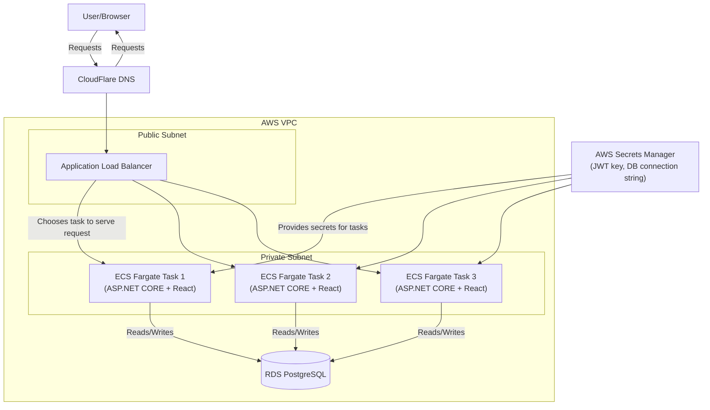

# Sudokubury - Online Sudoku Game

Sudokubury is a (mostly) single-page web application built for playing Sudoku, with support for generation of random puzzles, accounts for saving progress, and statistics tracking.

## Technologies used

- **Backend**
    - C#/ASP.NET CORE - language and web framework handling HTTP requests, routing, and middleware
    - Entity Framework Core - ORM mapping for C# models to PostgreSQL tables and queries
    - ASP.NET Identity - for user account management
    - JWT (JSON Web Tokens) - handles authentication after user login
    - PostgreSQL - database used for storing users, saved games, and statistics
        - Amazon RDS - AWS managed hosting for PostgreSQL instance in production

- **Frontend**
    - React - frontend library for building application interface
    - Typescript - language frontend is written in
    - Vite - build tool that bundles frontend code into static assets
    - React Router - client-side routing between views to make application single page (mostly)
    - Axios - frontend HTTP client to call backend API endpoints

- **Deployment**
    - Docker - builds frontend + backend into a single image
    - Terraform - defines and provisions all AWS infrastructure
    - ECS Fargate - AWS service to run the Docker container as a serverless task
    - AWS ECR - AWS managed service to provide a registry for Docker images
    - AWS Secrets Manager - stores secrets to be used in application
    - AWS CloudWatch - for monitoring/logging Docker containers
    - GitHub Actions - for CI/CD
    - Cloudflare - provides the DNS for application

## Cloud Architecture
> [!NOTE]
> Diagram is constructed under the assumption that several copies of the Docker container are deployed for load balancing and redundancy. Code within the Terraform files do not reflect this.**

Above is a diagram detailing the cloud infrastructure for the application. Flow of a request is as follows:

1. A user makes requests to sudokubury.dev (or whatever domain name was chosen)
2. The request is received on the Cloudflare DNS and routed to the Application Load Balancer (ALB) on the AWS Virtual Private Cloud (VPC).
3. When received on the ALB, it uses the default round-robin strategy to choose which task to serve a request, skipping over any task that fails its health check. 
    - The ALB also supports a least-outstanding-requests algorithm to route new requests to tasks which have the least in-flight requests. Round robin was chosen for its simplicity.

4. When chosen, the request is sent to the ECS task which serves the request and makes reads/writes to the database if necessary.
5. The response is then returned back through the ALB to the user.

The VPC is comprised of two subnets: public and private. The purpose of the public subnet is to accept ingress/egress from sources outside of the VPC, i.e., communicate with foreign users. The private subnet is strictly for internal use within the VPC. The ALB sits within the public subnet, while the ECS tasks sit within the private subnet. This separation allows for the tasks to remain hidden from outside sources while still allowing them to serve requests.
