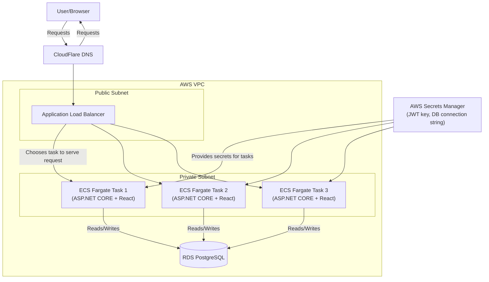

# Sudokubury - Online Sudoku Game

Sudokubury is a (mostly) single-page web application built for playing Sudoku, with support for generation of random puzzles, accounts for saving progress, and statistics tracking.

## Features
> [!NOTE]
> Project is a work in progess, so updates will be made periodically to this README when significant changes are made.

- Random Puzzle generation 
    - Includes difficulty settions for easy, medium, hard, and expert
    - Importing/Exporting games
    - Hint/Solution generation
- User accounts
    - Saving/Loading games
    - User statistics
    - Disposable Email Detection

## Technologies used

- **Backend**
    - C#/ASP.NET CORE - language and web framework handling HTTP requests, routing, and middleware
    - Entity Framework Core - ORM mapping for C# models to PostgreSQL tables and queries
    - ASP.NET Identity - for user account management
    - JWT (JSON Web Tokens) - handles authentication after user login
    - PostgreSQL - database used for storing users, saved games, and statistics
        - Amazon RDS - AWS managed hosting for PostgreSQL instance in production

- **Frontend**
    - React - frontend library for building application interface
    - Typescript - language frontend is written in
    - Vite - build tool that bundles frontend code into static assets
    - React Router - client-side routing between views to make application single page (mostly)
    - Axios - frontend HTTP client to call backend API endpoints

- **Deployment**
    - Docker - builds frontend + backend into a single image
    - Terraform - defines and provisions all AWS infrastructure
    - ECS Fargate - AWS service to run the Docker container as a serverless task
    - AWS ECR - AWS managed service to provide a registry for Docker images
    - AWS Secrets Manager - stores secrets to be used in application
    - AWS CloudWatch - for monitoring/logging Docker containers
    - GitHub Actions - for CI/CD
    - Cloudflare - provides the DNS for application

## Cloud Architecture
> [!NOTE]
> Diagram is constructed under the assumption that several copies of the Docker container are deployed for load balancing and redundancy. Code within the Terraform files do not reflect this.**

Above is a diagram detailing the cloud infrastructure for the application. Flow of a request is as follows:

1. A user makes requests to sudokubury.dev (or whatever domain name was chosen)
2. The request is received on the Cloudflare DNS and routed to the Application Load Balancer (ALB) on the AWS Virtual Private Cloud (VPC).
3.    When received on the ALB, it uses the default round-robin strategy to choose which task to serve a request, skipping over any task that fails its health check. 
- The ALB also supports a least-outstanding-requests algorithm to route new requests to tasks which have the least in-flight requests. Round robin was chosen for its simplicity.

4. When chosen, the request is sent to the ECS task which serves the request and makes reads/writes to the database if necessary.
5. The response is then returned back through the ALB to the user.

The VPC is comprised of two subnets: public and private. The purpose of the public subnet is to accept ingress/egress from sources outside of the VPC, i.e., communicate with foreign users. The private subnet is strictly for internal use within the VPC. The ALB sits within the public subnet, while the ECS tasks sit within the private subnet. This separation allows for the tasks to remain hidden from outside sources while still allowing them to serve requests.

## Backend Functionality

### Sudoku Service

The SudokuService controls all functionality related to the Sudoku board, which includes generation puzzles, creating/validating solutions, and conversion of Sudoku board into a string for importing/exporting.

The main highlight here is the Sudoku puzzle generation function, as this is the most important and complex function that the service provides. Here's how Sudoku generation works:

1. Initialize an empty 9x9 grid.
2. Iterate through each 3x3 subgroup within the diagonal of the grid.
3. In each iteration, fill the board randomly with numbers 1-9 without replacement.
4. Validate that the partially-filled out board is valid
    - I.e., ensure that a number only appears once per row, column, and within the 3x3 subgroup.
5. Service then solves the partially-filled board, filling in the remaining cells with valid choices.
    - The algorithm used is a backtracking solution. Essentially, for each empty cell, the service tries a valid choice. The algorithm continues choosing a valid choice until it reaches a cell with no valid choices, at which point it backtracks to the last valid choice used and tries a different choice. A detailed diagram explanation of the backtracking algorithm can be found below.
6. Once the board is completed, the service randomly removes entries until the amount of removals matches the requested difficulty level. After each removal, the service counts the number of solutions for the current puzzle to ensure that there is only one solution. It does so by re-solving it at the point of removal. If a removal doesn't work, it performs a similar backtracking algorithm to go back and try another choice.
    - Easy is 30 removals
    - Medium is 45 removals
    - Hard is 55 removals
    - Expert is 62 removals, the maximum amount of removals to ensure that the puzzle has only one unique solution.
7. Once the target number of entries are removed, the random puzzle is completed and returned.

The solved puzzle is stored on the backend to allow for faster solution checking and giving hints. 

An optimization that can be made here is storing the completed puzzles in a separate table within the database, and using these puzzles as "seeds". The idea here is that when the user requests a new puzzle, the server can take a random seed puzzle and build the random puzzle board from this seed, effectively removing steps 1-5 of the above. The key advantage here is that the database can be pre-filled with hundreds or thousands of seed puzzles, removing a good chunk of computational time from initial seed generation. 
